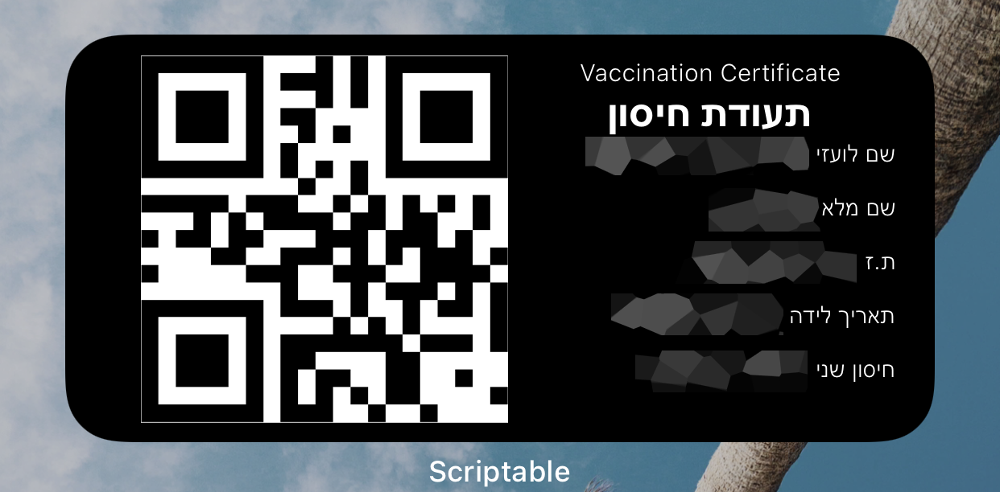

# GreenBadgeWidget
## Show your green badge QR code and document - FAST!
<h2>Installation instructions</h2>

1. Download the script and place it under Scriptable folder inside you iCloud storage.
2. Create new directory under you Scriptable directory called "Covid19".
3. Place you green badge pdf (document.pdf) and a screenshot of your QR code (qr.png) under the Covid19 directory.
4. Run the script to make sure that there are no problems with the hierarchies.
5. Add the script as **medium** size on your home scree.
6. Enjoy

